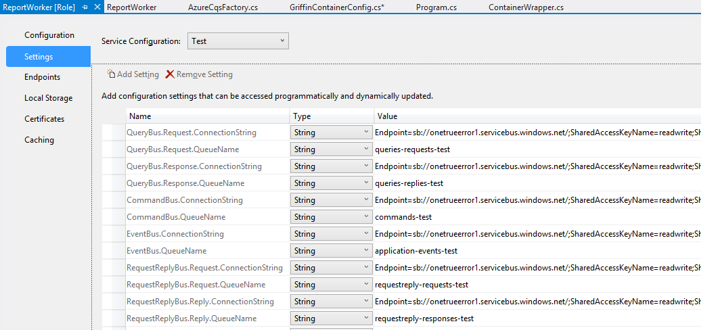

WindowsAzure.ServiceBus.CQS
===========================

Command/Query separation library for WindowsAzure.ServiceBus

# Client side configuration

	var factory = new AzureCqsFactory();
	inversionOfControlContainer.RegisterService<ICommandBus>(x => factory.CreateCommandBus(), Lifetime.Singleton);
	inversionOfControlContainer.RegisterService<IEventBus>(x => factory.CreateEventBus(), Lifetime.Singleton);
	inversionOfControlContainer.RegisterService<IQueryBus>(x => factory.CreateQueryBus(), Lifetime.Singleton);
	inversionOfControlContainer.RegisterService<IRequestReplyBus>(x => factory.CreateRequestReplyBus(), Lifetime.Singleton);

# Server side configuration

    public class WorkerRole : RoleEntryPoint
    {
        private AzureCommandBusListener _commandBus;
        private AzureEventBusListener _eventBus;
        private AzureQueryBusListener _queryBus;
        private AzureRequestReplyBusListener _requestReplyBus;
        private Container _container; //ioc

        public override bool OnStart()
        {
			// [...]
			
            var factory = new AzureCqsFactory();
            var containerBuilder = new ContainerRegistrar();
			// [...]
			
			// execute commands, queries, request/reply inhouse instead of sending them over Azure.ServiceBus.
            containerBuilder.RegisterService<ICommandBus>(x => new ContainerCommandBus(_container)); 
            containerBuilder.RegisterService<IQueryBus>(x => new ContainerQueryBus(_container));
            containerBuilder.RegisterService<IRequestReplyBus>(x => new ContainerRequestReplyBus(_container));

            _container = containerBuilder.Build();

			// Listeners accept and execute the messages from client/side.
            _eventBus = factory.CreateEventBusListener(new ContainerWrapper(_container));
            _commandBus = factory.CreateCommandBusListener(new ContainerWrapper(_container));
            _queryBus = factory.CreateQueryBusListener(new ContainerWrapper(_container));
            _requestReplyBus = factory.CreateRequestReplyBusListener(new ContainerWrapper(_container));

            _eventBus.Start();
            _commandBus.Start();
            _queryBus.Start();
            _requestReplyBus.Start();

            return base.OnStart();
        }

        public override void OnStop()
        {
            _eventBus.Stop();
            _commandBus.Stop();
            _queryBus.Stop();
            _requestReplyBus.Stop();

            base.OnStop();
        }
    }

# Configuration

Just configure the queues that you've created in the Windows Azure management portal.

